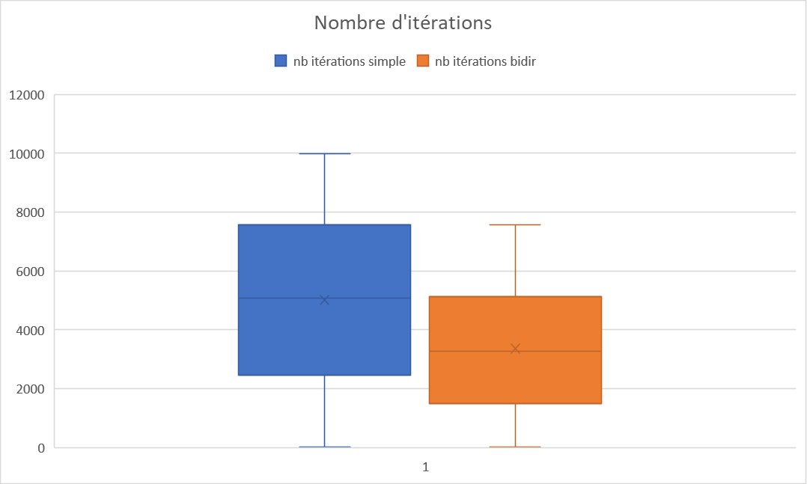
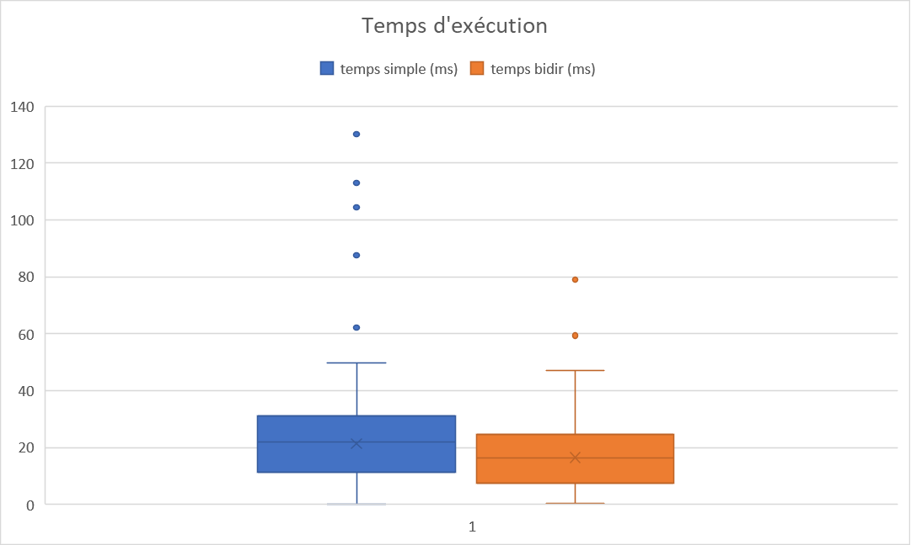

# GRE Labo Dijkstra
2021-2022 | Luca Coduri

Dans le cadre du cours de graphe et réseau à la HEIG, j'ai dû implémenter en java la version simple et bidirectionnel de Dijkstra.
Ce laboratoire nous permet de mieux comprendre le fonctionnement de l'algorithme ainsi que les avantages et inconvenient de sa version bidirectionnelle.

## Choix d'implémentation
Pour ce projet, j'ai choisi d'utiliser Maven afin d'effectuer des tests.
J'ai trouvé ça particulièrement pratique, car en modifiant le code, je pouvais vérifier que tout fonctionnait encore.

## Méthode d'analyse
Pour pouvoir comparer les 2 variantes de Dijkstra il est nécessaire de récolter des données.
Il nous est donc demandé de générer 1000 sommets source et target que l'on fourni à nos algorithmes.
On récolte ensuite le nombre d'itérations par couple source-target, les sommets par lesquels il faut passer ainsi que la distance totale.
J'ai également trouvé judicieux de calculer le temps de calcul de chaque algorithme, bien que cela n'était pas spécifié, dans une optique de comparaison des performances.
J'ai finalement synthétisé ces données dans un tableau de résultats, dont vous trouverez un échantillon ci-dessous, contenant les informations suivantes :
- sommet source
- sommet destination
- nombre d'itérations pour Dijkstra simple
- nombre d'itérations pour Dijkstra bidirectionnel
- temps d'exécution en millisecond pour Dijkstra simple
- temps bidirectionnel en millisecond pour Dijkstra bidirectionnel

Pour avoir une meilleure idée et pouvoir plus facilement interpréter les données, j'ai aussi calculé quelques statistiques :
- Nombre de fois que le bidirectionnel prend moins de temps
- Nombre de fois que le bidirectionnel à moins d'itérations
- Nombre d'itérations moyen pour le bidirectionnel
- Nombre d'itérations moyen pour le simple
- Temps moyen pour le bidirectionnel
- Temps moyen pour le simple

## Mes résultats

Voici un aperçu des 20 premières lignes de mes [résultats](results.md) :

| n°   | source | destination | distance | nb itérations simple | nb itérations bidir | temps simple (ms) | temps bidir (ms) |
|------|--------|-------------|----------|----------------------|---------------------|-------------------|------------------|
| 1    | 7611   | 5959        | 7292     | 5893                 | 5071                | 130.0882          | 59.3802          |
| 2    | 5024   | 9036        | 5711     | 3264                 | 2685                | 24.1354           | 47.0268          |
| 3    | 1569   | 5469        | 7680     | 7601                 | 6230                | 45.697            | 40.2226          |
| 4    | 3363   | 7911        | 987      | 200                  | 121                 | 1.0284            | 1.2305           |
| 5    | 6946   | 4726        | 4360     | 3128                 | 2164                | 15.2821           | 30.1847          |
| 6    | 9083   | 3706        | 8426     | 6392                 | 5559                | 62.1951           | 30.4398          |
| 7    | 8743   | 8774        | 8903     | 7974                 | 5650                | 45.2938           | 31.6172          |
| 8    | 190    | 2756        | 2208     | 1020                 | 699                 | 21.0822           | 15.8482          |
| 9    | 245    | 2721        | 8948     | 7830                 | 3991                | 104.3614          | 27.476           |
| 10   | 8293   | 1964        | 10042    | 8974                 | 6401                | 46.3361           | 36.7287          |
| 11   | 747    | 7460        | 4306     | 2700                 | 1662                | 17.5944           | 11.4371          |
| 12   | 5319   | 3339        | 3352     | 2535                 | 1582                | 15.287            | 10.3686          |
| 13   | 5336   | 8974        | 3713     | 1143                 | 917                 | 6.1623            | 6.3144           |
| 14   | 9332   | 7544        | 7409     | 5513                 | 4458                | 87.5547           | 79.0331          |
| 15   | 8489   | 2014        | 8951     | 8997                 | 6740                | 112.9867          | 33.2886          |
| 16   | 1287   | 7167        | 1611     | 693                  | 352                 | 3.4118            | 2.3124           |
| 17   | 9440   | 7626        | 5405     | 6002                 | 4121                | 25.8425           | 20.0126          |
| 18   | 1887   | 7245        | 6138     | 4410                 | 3683                | 19.8113           | 18.0177          |
| 19   | 1904   | 9033        | 4973     | 3137                 | 2333                | 14.4027           | 11.4632          |
| 20   | 7511   | 5946        | 5641     | 7798                 | 3003                | 30.8753           | 16.1016          |

**Temps moyen bidirectionnel:`17.492473785`**

**Temps moyen simple: `22.610268852`**

**Nombre de fois que bidirectionnel prend moins de temps : `944/1000`**

**Nombre de fois que Bidirectionnel à moins d'itérations : `998/1000`**

**Nombre d'itérations moyen bidirectionnel: `3366.34`**

**Nombre d'itérations moyen simple: `5008.845`**

**Temps moyen bidirectionnel: `17.407039388999998 ms`**

**Temps moyen simple: `22.533634783 ms`**

## Conclusion
On remarque que l'algorithme Dijkstra bidirectionnel est le grand vainqueur de ce test.
Ce dernier itère beaucoup moins que la version simple ce qui lui permet en grande majorité d'être plus rapide dans la résolution du chemin le plus court.
Il est possible que malgré qu'il ait moins d'itérations, il prenne plus de temps. Ceci arrive quand la solution se trouve dans les premières itérations.
En effet l'algorithme est plus efficace en nombre d'itérations, mais légèrement plus lent par itération que sa version simple.